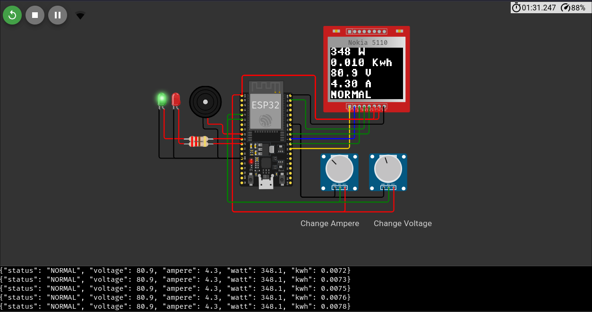

# IoT Energy Monitoring – Pseudo Smart Grid Node

## Project Description

This project is an implementation of an **Internet of Things (IoT)-based electrical energy monitoring system** that functions as a **pseudo smart grid node**. The system is designed to monitor **voltage, current, power, and electrical energy consumption (kWh)** in real time using an **ESP32 microcontroller**.

The measurement data is displayed locally on a **Nokia 5110 LCD** and transmitted to a server using the **MQTT protocol**, enabling remote monitoring. The system is also equipped with a **load protection mechanism**, consisting of LED indicators and a buzzer that activate when the measured power exceeds a predefined limit (*overload condition*).

Although the system already implements digital monitoring and data communication, decision-making and control are still performed locally and in a limited manner. Therefore, this system is categorized as a **pseudo smart grid**, representing a transitional stage from a conventional power grid toward a fully automated and integrated smart grid.

This project is suitable for **educational purposes**, **small-scale smart grid simulation**, and as a foundation for the development of more advanced **energy management systems**.

---



## Hardware Requirements

* ESP32 Development Board
* Voltage Sensor (AC or simulated input)
* Current Sensor (e.g., ACS712 or simulated input)
* Nokia 5110 LCD
* LEDs (Normal & Overload indicators)
* Buzzer
* Connecting wires and power supply

---

## Software Requirements

* MicroPython firmware for ESP32
* MQTT Broker (e.g., broker.mqttdashboard.com)
* WiFi connection
* Optional: MQTT client/dashboard (Node-RED, MQTT Explorer, ThingsBoard)

---

## How to Run

1. **Flash MicroPython Firmware**
   Install MicroPython on the ESP32 using `esptool.py`.

2. **Upload the Code**
   Upload the Python script to the ESP32 using tools such as:

   * Thonny IDE
   * ampy
   * rshell

3. **Configure WiFi and MQTT**
   Edit the following variables in the code if necessary:

   ```python
   WIFI_SSID = "Your_WiFi_SSID"
   WIFI_PASS = "Your_WiFi_Password"

   MQTT_BROKER = "broker.mqttdashboard.com"
   MQTT_TOPIC = "wokwi/energy"
   ```

4. **Power On the ESP32**
   Once powered, the ESP32 will automatically:

   * Connect to the WiFi network
   * Connect to the MQTT broker
   * Start measuring voltage, current, power, and energy

5. **Monitor the Data**

   * View real-time values on the Nokia 5110 LCD
   * Subscribe to the MQTT topic using an MQTT client to monitor data remotely

6. **Overload Protection**

   * If power exceeds the predefined limit, the overload LED and buzzer will activate
   * Normal operation is indicated by the normal-status LED

---

## Notes

* Sensor calibration is required for real-world deployment to improve measurement accuracy.
* The current implementation uses simplified calculations suitable for simulation and prototyping.
* The system can be extended with remote control, data logging, or multi-node integration to achieve full smart grid functionality.
